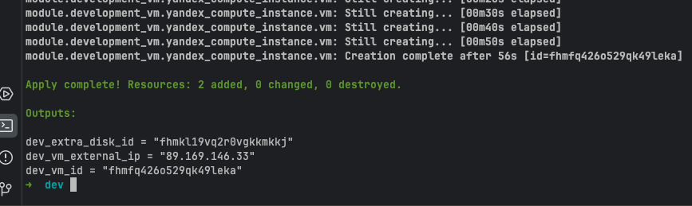

# Модуль развёртывания ВМ — TaskAdvanced1

Универсальный Terraform-модуль для создания виртуальных машин в Yandex Cloud.
Один модуль — три независимых окружения: `dev`, `stage`, `prod`.



## Структура проекта

```
TaskAdvanced1/
├── modules/
│   └── vm/               # Переиспользуемый модуль
│       ├── main.tf
│       ├── variables.tf
│       └── outputs.tf
└── envs/
    ├── dev/              # 2 CPU / 2 GB / 10 GB disk
    │   ├── main.tf
    │   └── terraform.tfvars
    ├── stage/            # 4 CPU / 8 GB / 20 GB disk
    │   ├── main.tf
    │   └── terraform.tfvars
    └── prod/             # 8 CPU / 16 GB / 50 GB disk
        ├── main.tf
        └── terraform.tfvars
```

## Входные параметры модуля

| Переменная       | Тип    | Обязательная | Описание                                      |
|------------------|--------|:------------:|-----------------------------------------------|
| `vm_name`        | string | Да           | Имя виртуальной машины                        |
| `cores`          | number | Да           | Количество ядер CPU                           |
| `memory`         | number | Да           | Объём RAM (ГБ)                                |
| `subnet_id`      | string | Да           | ID подсети в Yandex Cloud                     |
| `ssh_public_key` | string | Да           | Публичный SSH-ключ для доступа к ВМ           |
| `boot_image_id`  | string | Да           | ID образа ОС (например, Ubuntu 22.04)         |
| `extra_disk_size`| number | Нет (10 ГБ)  | Размер дополнительного диска (ГБ)             |
| `zone`           | string | Нет (ru-central1-a) | Зона доступности Yandex Cloud          |

## Выходные параметры модуля

| Переменная     | Описание                          |
|----------------|-----------------------------------|
| `vm_id`        | ID созданной виртуальной машины   |
| `vm_name`      | Имя виртуальной машины            |
| `internal_ip`  | Внутренний IP-адрес               |
| `external_ip`  | Внешний (NAT) IP-адрес            |
| `extra_disk_id`| ID дополнительного диска          |

## Конфигурации окружений

| Окружение | CPU | RAM  | Доп. диск | Назначение              |
|-----------|-----|------|-----------|-------------------------|
| dev       | 2   | 2 ГБ | 10 ГБ     | Разработка и отладка    |
| stage     | 4   | 8 ГБ | 20 ГБ     | Приёмочное тестирование |
| prod      | 8   |16 ГБ | 50 ГБ     | Продакшн                |

---

## Тестирование в Yandex Cloud

### Предварительные требования

Установить на локальной машине:
- [Terraform](https://developer.hashicorp.com/terraform/install) >= 1.3
- [yc CLI](https://yandex.cloud/ru/docs/cli/quickstart)

### Шаг 1. Настройка yc CLI

```bash
yc init
```

Введите OAuth-токен (получить на https://oauth.yandex.ru/authorize?response_type=token&client_id=1a6990aa636648e9b2ef855fa7bec2fb), выберите облако и каталог.

Получить нужные ID:

```bash
yc config list          # показывает token, cloud-id, folder-id
yc vpc subnet list      # список подсетей — нужен subnet_id
```

### Шаг 2. Получить ID образа Ubuntu 22.04

```bash
yc compute image list --folder-id standard-images | grep ubuntu-22
```

Найдите последнюю версию `ubuntu-22-04-lts`. ID выглядит как `fd8mfc6omiki5govl68h` (меняется со временем — всегда проверяйте актуальный).

### Шаг 3. Сгенерировать SSH-ключ

```bash
ssh-keygen -t ed25519 -f ~/.ssh/yc_vm_key -C "yc-vm"
cat ~/.ssh/yc_vm_key.pub   # скопировать в terraform.tfvars
```

### Шаг 4. Установить переменные окружения

Terraform провайдер Yandex Cloud читает учётные данные из переменных окружения:

```bash
export YC_TOKEN=$(yc iam create-token)
export YC_CLOUD_ID=$(yc config get cloud-id)
export YC_FOLDER_ID=$(yc config get folder-id)
```

> Токен действует 12 часов. Повторите команду `yc iam create-token` при истечении.

### Шаг 5. Заполнить terraform.tfvars

Откройте `envs/dev/terraform.tfvars` и замените плейсхолдеры реальными значениями:

```hcl
env_subnet_id = "e9b..."          # из шага 1
env_image_id  = "fd8mfc6omiki5govl68h"  # из шага 2
env_ssh_key   = "ssh-ed25519 AAAA..."   # из шага 3
```

### Шаг 6. Запустить Terraform для dev

```bash
cd envs/dev

terraform init
terraform plan -var-file=terraform.tfvars
terraform apply -var-file=terraform.tfvars
```

После успешного `apply` Terraform выведет:

```
Outputs:
dev_vm_id          = "fhm..."
dev_vm_external_ip = "84.201.x.x"
dev_extra_disk_id  = "fhm..."
```

### Шаг 7. Проверить результат

**Подключиться по SSH:**

```bash
ssh -i ~/.ssh/yc_vm_key ubuntu@<dev_vm_external_ip>
```

**Проверить дополнительный диск внутри ВМ:**

```bash
lsblk
# Ожидаемый вывод: vdb — 10G (для dev)
```

**Проверить ВМ в консоли:**

```bash
yc compute instance list
yc compute disk list
```

### Шаг 8. Проверить остальные окружения

Повторите шаги 5–7 для `stage` и `prod`:

```bash
cd ../stage
terraform init && terraform apply -var-file=terraform.tfvars

cd ../prod
terraform init && terraform apply -var-file=terraform.tfvars
```

Убедитесь что каждое окружение создаёт ВМ с правильными параметрами:
- `yc compute instance get <vm_name>` — проверить CPU и RAM
- `yc compute disk get <disk_name>` — проверить размер диска

### Шаг 9. Удалить ресурсы после проверки

```bash
# Из каждой директории окружения:
terraform destroy -var-file=terraform.tfvars
```

> Оставленные запущенные ВМ тарифицируются. Всегда делайте `destroy` после тестирования.
