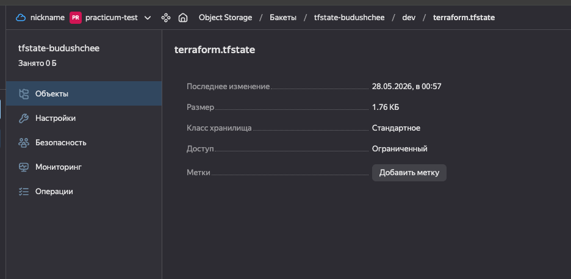
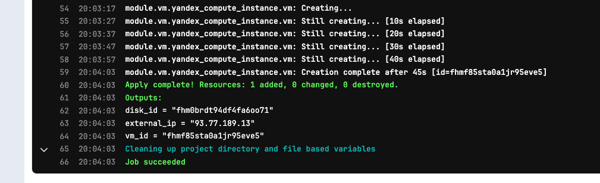

# TaskAdvanced2 — CI/CD и удалённое хранение Terraform-состояния




## Что реализовано

- Terraform-конфигурация с S3 backend на **Yandex Object Storage** (состояние не хранится локально)
- GitLab CI/CD pipeline: `validate → plan → apply (по кнопке)`
- Изоляция секретов: никаких токенов в коде — только GitLab CI Variables

## Структура

```
TaskAdvanced2/
├── modules/
│   └── vm/              # Переиспользуемый модуль ВМ
│       ├── main.tf
│       ├── variables.tf
│       └── outputs.tf
├── envs/
│   └── dev/
│       ├── main.tf      # Backend + provider + вызов модуля
│       └── terraform.tfvars
├── .gitlab-ci.yml
└── README.md
```

## Remote State (S3 Backend)

Состояние хранится в **Yandex Object Storage**:

| Параметр | Значение |
|----------|----------|
| Bucket   | `tfstate-budushchee` |
| Key      | `dev/terraform.tfstate` |
| Endpoint | `https://storage.yandexcloud.net` |
| Region   | `ru-central1` |

Bucket нужно создать заранее вручную (один раз):

```bash
yc storage bucket create --name tfstate-budushchee
```

Credentials для доступа к бакету — **статические ключи сервисного аккаунта**, передаются через переменные окружения `AWS_ACCESS_KEY_ID` / `AWS_SECRET_ACCESS_KEY`. Terraform использует их автоматически.

## Аутентификация в Yandex Cloud

`YC_TOKEN` (из `yc iam create-token`) живёт только 12 часов — для CI не подходит.

В CI используется **авторизованный ключ сервисного аккаунта** — JSON-файл, который не истекает.

Как получить:
```bash
# Создать сервисный аккаунт
yc iam service-account create --name terraform-ci

# Выдать права на каталог
yc resource-manager folder add-access-binding <FOLDER_ID> \
  --role editor \
  --subject serviceAccount:<SA_ID>

# Создать авторизованный ключ
yc iam key create --service-account-name terraform-ci --output sa-key.json
```

Содержимое `sa-key.json` кладётся в GitLab как **File variable** `YC_SA_KEY_JSON` — GitLab сам записывает его в файл и передаёт путь через переменную окружения. В pipeline этот путь передаётся в `YC_SERVICE_ACCOUNT_KEY_FILE`, который провайдер Yandex читает автоматически.

## CI/CD Variables (GitLab → Settings → CI/CD → Variables)

| Переменная | Тип | Описание |
|------------|-----|----------|
| `YC_SA_KEY_JSON` | **File** | JSON авторизованного ключа сервисного аккаунта |
| `YC_CLOUD_ID` | Variable (masked) | ID облака |
| `YC_FOLDER_ID` | Variable (masked) | ID каталога |
| `AWS_ACCESS_KEY_ID` | Variable (masked) | Статический ключ для Object Storage (backend) |
| `AWS_SECRET_ACCESS_KEY` | Variable (masked) | Секрет статического ключа |

Никаких секретов в `terraform.tfvars` или коде нет.

## Pipeline

```
merge request → validate → plan         (артефакт: tfplan)
main branch   → validate → plan → apply (apply — только по кнопке)
```

### Стадии

**validate** — проверяет синтаксис и корректность конфигурации (`terraform validate`). Запускается на MR и в main.

**plan** — строит план изменений (`terraform plan -out=tfplan`). Артефакты сохраняются на 1 неделю и доступны в интерфейсе GitLab.

**apply** — применяет сохранённый план (`terraform apply tfplan`). Запускается **только вручную** (кнопка в GitLab UI) и **только в ветке main**. Использует артефакт из стадии `plan`, а не строит новый план — это гарантирует, что применяется именно то, что было проверено.

## Запуск вручную (локально)

Локально можно использовать короткоживущий `YC_TOKEN` — он удобен для разработки:

```bash
cd TaskAdvanced2/envs/dev

export AWS_ACCESS_KEY_ID=<статический-ключ>
export AWS_SECRET_ACCESS_KEY=<секрет-ключа>
export YC_TOKEN=$(yc iam create-token)
export YC_CLOUD_ID=$(yc config get cloud-id)
export YC_FOLDER_ID=$(yc config get folder-id)

terraform init
terraform plan -var-file=terraform.tfvars
terraform apply -var-file=terraform.tfvars
```
