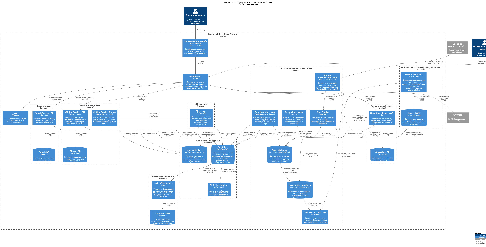
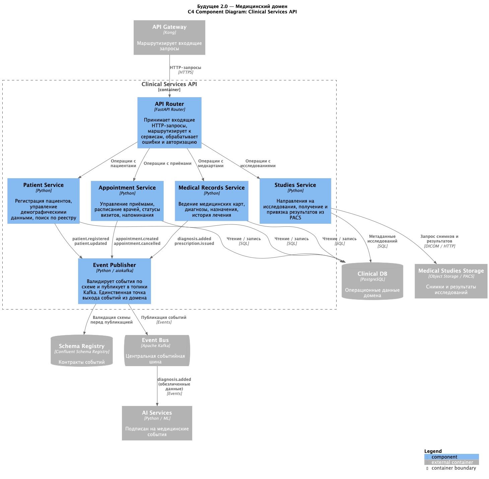
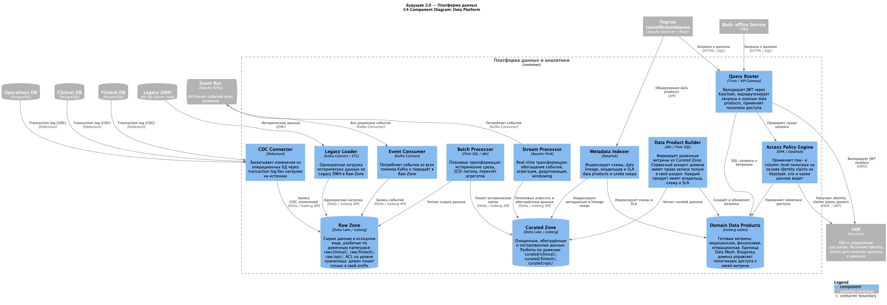

# Задание 3. Целевая архитектура и оценка рисков — Будущее 2.0

## C4-диаграмма

Целевая архитектура на горизонте 3 лет. Ключевые решения:

- Домены изолированы по принципу database-per-domain — нет прямых обращений к чужим БД
- Междоменное взаимодействие только через Event Bus (Kafka) — нет синхронных вызовов между доменами
- Аналитическая плоскость (Ingestion → Flink → DataLake → Data Products → Portal) отделена от операционной
- Schema Registry обеспечивает контрактную валидацию событий перед публикацией
- Legacy ESB выполняет роль анти-коррупционного слоя и выводится по завершении миграции (до 18 мес.)

[Диаграмма компонентов медицинского домена](./03_components_clinical.puml)

[Диаграмма компонентов платформы данных](./04_components_data_platform.puml)

---

## Карта рисков трансформации

| ID | Риск                                                                                                                                                                                                                | Тип             | Вероятность | Влияние |
|----|---------------------------------------------------------------------------------------------------------------------------------------------------------------------------------------------------------------------|-----------------|-------------|---------|
| А1 | **Потеря бизнес-процессов при миграции** — Legacy DWH не задокументирован; логика в хранимых процедурах и ETL может быть утеряна при переносе                                                                       | Архитектурный   | Высокая     | Высокое |
| О1 | **Сопротивление команды изменениям** — переход на новый стек и процессы вызывает пассивное или активное сопротивление, замедляя трансформацию                                                                       | Организационный | Высокая     | Среднее |
| О2 | **Отсутствие владельцев доменов** — нет опыта domain-driven разделения и назначенных data owners; без этого Data Mesh и DataCatalog не работают                                                                     | Организационный | Высокая     | Высокое |
| О3 | **Скилл-гэп команды** — отсутствие экспертизы для создания и поддержки распределённой архитектуры приводит к некачественным решениям и срыву сроков                                                                 | Организационный | Высокая     | Высокое |
| О4 | **Перегрузка команды безопасности** — переход на микросервисы кратно увеличивает периметр; при нехватке ресурсов растёт вероятность пропущенной уязвимости                                                          | Организационный | Высокая     | Среднее |
| Ф1 | **Удорожание инфраструктуры** — облачные managed-сервисы (Kafka, Flink, Object Storage) и рост числа компонентов существенно увеличивают операционные расходы относительно текущего монолита                        | Финансовый      | Средняя     | Среднее |
| Т1 | **Несоответствие законодательству при выходе на новые рынки** — каждая юрисдикция предъявляет отдельные требования к хранению медицинских и финансовых данных; текущая архитектура не разделяет data residency зоны | Технологический | Средняя     | Высокое |

---

## План управления рисками

### А1 — Потеря бизнес-процессов при миграции

**Меры:** техническое + управленческое.

- Провести аудит хранимых процедур и ETL до начала миграции: задокументировать все трансформации и выявить скрытую бизнес-логику
- Запустить dual-write период: новые домены пишут в свои БД и параллельно сверяются с Legacy DWH по ключевым метрикам
- Установить критерий выхода из миграции: расхождение в отчётах не превышает допустимый порог в течение 30 дней подряд

### О1 — Сопротивление команды изменениям

**Меры:** управленческое.

- Вовлечь ключевых представителей команды в проектирование на раннем этапе — изменения, в которых люди участвовали, принимаются легче
- Показать конкретные выгоды для каждой роли: разработчики получают независимость деплоя, аналитики — самообслуживание без очереди к DBA
- Обеспечить переходный период с параллельным доступом к старым инструментам, не отрезая сразу

### О2 — Отсутствие владельцев доменов

**Меры:** управленческое.

- Назначить domain owner для каждого домена до запуска платформы данных — это организационное решение, не техническое
- Ввести SLA на data products как KPI команд: актуальность, задержка обновления, задокументированность в DataCatalog
- Установить правило: data product без зарегистрированного владельца не публикуется в портал

### О3 — Скилл-гэп команды

**Меры:** управленческое + техническое.

- Составить матрицу необходимых компетенций по фазам роудмапа и оценить текущее покрытие
- Для критических технологий (Kafka, Flink) привлечь внешних консультантов на фазу 1 с обязательной передачей знаний внутренней команде
- Запустить параллельные треки обучения: инфраструктурные инженеры, аналитики данных, разработчики доменов — разные программы

### О4 — Перегрузка команды безопасности

**Меры:** техническое.

- Централизовать управление доступом через IAM (Keycloak): единая политика вместо настройки в каждом сервисе отдельно
- Автоматизировать аудит через DataCatalog: классификация данных и ролевые политики, а не ручные проверки
- Ввести security review как обязательный gate при добавлении нового домена или топика событий — не постфактум

### Ф1 — Удорожание инфраструктуры

**Меры:** управленческое + техническое.

- Провести TCO-анализ до начала фазы 1: сравнить текущие расходы на поддержку Legacy с прогнозируемыми облачными затратами
- Использовать managed-сервисы на старте для снижения операционной нагрузки, но отслеживать cost per domain как метрику
- Заложить бюджетный триггер: если расходы превышают прогноз на X%, пересматривать решения о managed vs self-hosted

### Т1 — Несоответствие законодательству при выходе на новые рынки

**Меры:** техническое + управленческое.

- До выхода в каждый новый регион — обязательный юридический аудит требований к хранению медицинских и финансовых данных
- Рассмотреть отдельное региональное развёртывание системы как основной сценарий: изолированный стек на инфраструктуре в нужной юрисдикции проще, чем data residency зоны внутри одного кластера
- Проверить покрытие Yandex Cloud целевыми регионами; при выходе за пределы СНГ может потребоваться смена или добавление провайдера

